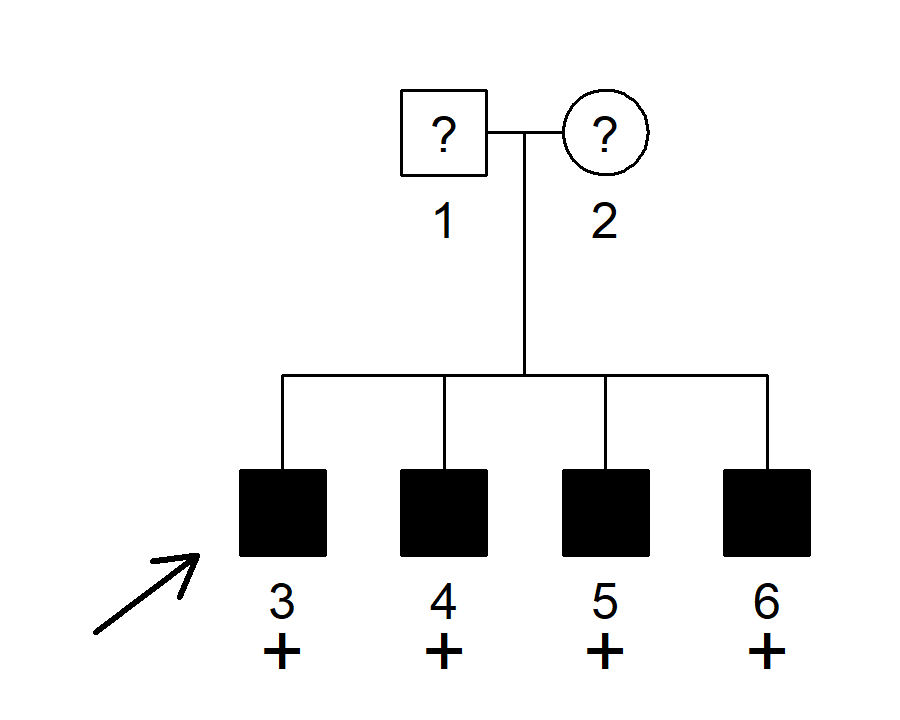

<!-- README.md is generated from README.Rmd. Please edit that file -->

# segregatr

<!-- badges: start -->

[](https://CRAN.R-project.org/package=segregatr)
[](https://cran.r-project.org/package=segregatr)
[](https://cran.r-project.org/package=segregatr)
<!-- badges: end -->

The goal of **segregatr** is to provide segregation analysis for
clinical variant classification. Specifically it facilitates the
calculation of full-likelihood Bayes factors (FLBs) in any medical
pedigree.

#### Citation

If you use **segregatr** in a publication, please cite this paper:
Ratajska et al. (2023). [The use of segregation analysis in
interpretation of sequence variants in
SMAD3](https://doi.org/10.1002/mgg3.2107).

The paper includes applications of the package in real-life diagnostic
cases.

#### Shiny app

A Shiny app **shinyseg** for clinical segregation analysis is now
available! Check it out here:
<https://chrcarrizosa.shinyapps.io/shinyseg/>.

The app is based on **segregatr**, but offers a wealth of additional
features:

- interactive visualisations
- complex disease modelling
- sensitivity analysis
- clinical interpretation for use in the ACMG-AMP framework

For details, see Carrizosa et al. (2024): [shinyseg: a web application
for flexible cosegregation and sensitivity
analysis](https://doi.org/10.1093/bioinformatics/btae201).

## Installation

You can install **segregatr** from CRAN as follows:

``` r
install.packages("segregatr")
```

Alternatively, obtain the latest development version from GitHub:

``` r
devtools::install_github("magnusdv/segregatr")
```

## Example

``` r
library(segregatr)
```

The family below shows four brothers, all affected with a rare dominant
disease with 90% penetrance and phenocopy rate 1%. The parents have
unknown affection status. All four brothers are shown to carry a
candidate variant.



We will use **segregatr** to analyse the co-segregation of the variant
and the disease in this pedigree. Specifically we want to compute the
*full-likelihood Bayes factor* (FLB), quantifying the evidence that the
variant is pathogenic.

To create the pedigree we use the `nuclearPed()` function from the
**pedtools** package, which is automatically loaded together with
**segregatr**.

``` r
x = nuclearPed(4)
```

Then we run the `FLB()` function, filling in the necessary data:

``` r
FLB(x, carriers = 3:6, affected = 3:6, unknown = 1:2,
    freq = 0.0001, penetrances = c(0.01, 0.9, 0.9), proband = 3)
#> [1] 7.732161
```

The resulting FLB score amounts to *suggestive evidence* for
pathogenicity, according to the thresholds suggested by [Jarvik and
Browning (2016)](https://doi.org/10.1016/j.ajhg.2016.04.003).
